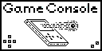

# *Game Console*

*Игрална ретро конзола с два бутона и собствен език за програмиране на игри.*

## Как да си сваля и използвам проекта?

### Инструкции за инсталация

1) Трябва на компютъра да има инсталиран **Python3**.
2) Трябва на компютъра да има инсталирано **Arduino**.
3) Кода трябва да се свали от **GitHub**.

### Инструкции за стартиране на проекта

1) Напишете своята игра или използвайте нашите тестови игри.
2) След товя я компилирате, като я подадете като първи аргумент на **main file** в папка **Compiler**.
3) След това взимате *Bytecode* и го поставяте в масива **Program**.
4) Поставя се броя команди в константата **PROGRAM_SIZE**.
5) Проверява се и се качва в **Arduino**.

## Използвани технологии

### 1. Езици за програмиране

* [Python3](линк към официанлния сайт на технологията)
* [Arduino](линк към официанлния сайт на технологията)

## Информация за авторите на проекта

* **Георги Димитров Корчаков** - *Директор на проекта, програмист, хардуерист* - [georgikorchakov](https://github.com/georgikorchakov)

* **Мартин Маринов Кондов** - *Дизайнер, програмист* - [martisterst](https://github.com/martisterst)